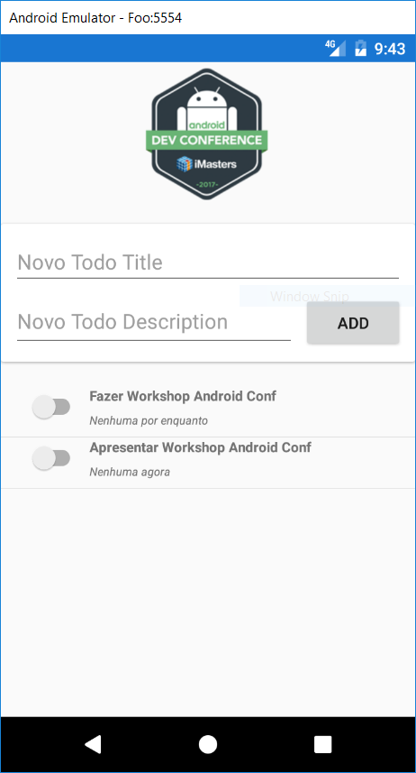

# Projeto criado por Vinicius Quaiato para Android Conference 2017

Este projeto foi criado para ser utilizado no Workshop de Xamarin Forms da Android Cofnerence 2017. 

O intuito dele é mostrar conceitos básicos do Xamarin Forms como: Layouts, Pages, MVVM e Binding, XAML

